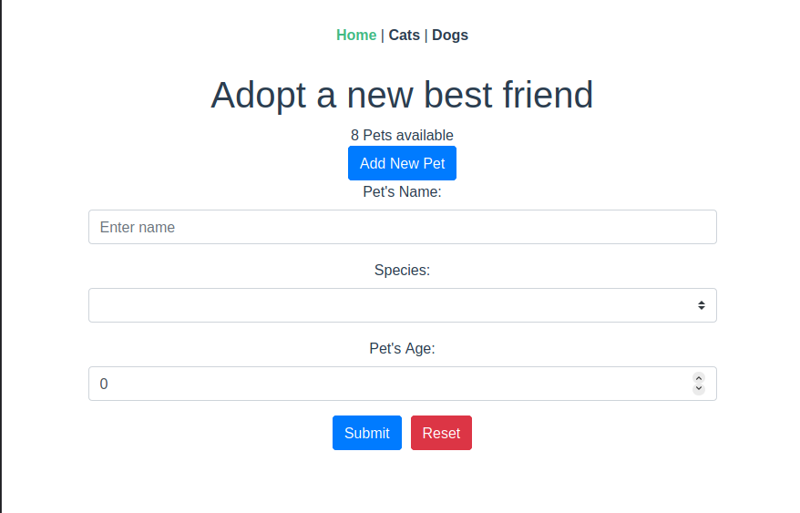

# vue-adopt-pets-app
A simple app to view adoptable Dogs 🐕 or Cats 🐈. 

The purpose was to understand VueX state management.

I feel like that sounded too serious. 

**Damn! Just found out it's my birthday today 🧁**

I only wish for progress in my programming career. Plus all those good things we always ask God for 😃

## Project setup
```
yarn install
```

### Compiles and hot-reloads for development
```
yarn serve
```

### Compiles and minifies for production
```
yarn build
```

### How's it look?



Hold it there! 🤐 I know it's ugly.